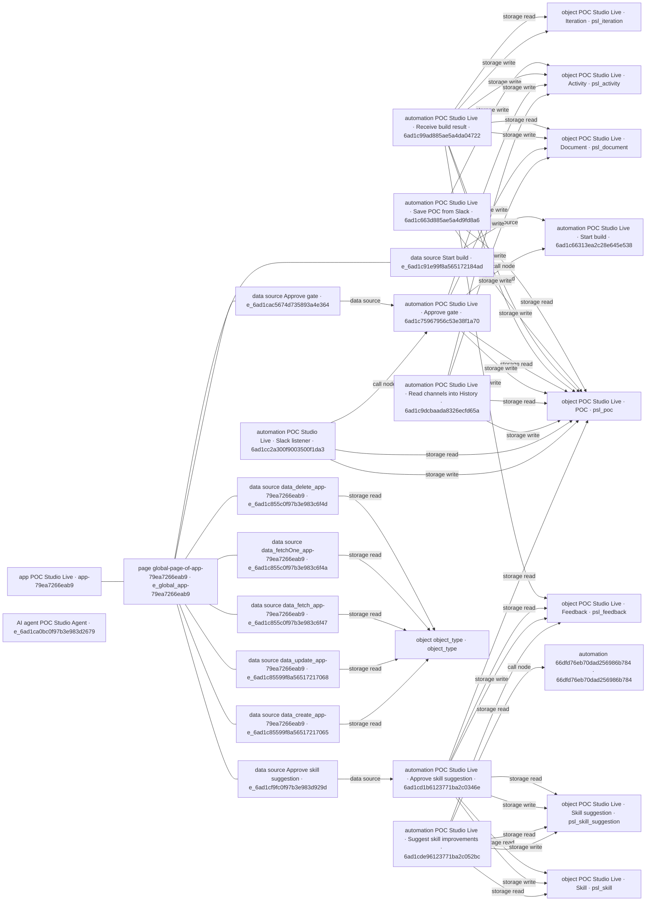

Tenant orbit.uat.unifyapps.com · solution "POC Studio Live" (e_6ad1b45199f8a565171d7f1c)

```mermaid
flowchart LR
  n1["app POC Studio Live · app-79ea7266eab9"]
  n2["page global-page-of-app-79ea7266eab9 · e_global_app-79ea7266eab9"]
  n3["data source Approve skill suggestion · e_6ad1cf9fc0f97b3e983d929d"]
  n4["data source Approve gate · e_6ad1cac5674d735893a4e364"]
  n5["data source Start build · e_6ad1c91e99f8a565172184ad"]
  n6["data source data_delete_app-79ea7266eab9 · e_6ad1c855c0f97b3e983c6f4d"]
  n7["data source data_fetchOne_app-79ea7266eab9 · e_6ad1c855c0f97b3e983c6f4a"]
  n8["data source data_fetch_app-79ea7266eab9 · e_6ad1c855c0f97b3e983c6f47"]
  n9["data source data_update_app-79ea7266eab9 · e_6ad1c85599f8a56517217068"]
  n10["data source data_create_app-79ea7266eab9 · e_6ad1c85599f8a56517217065"]
  n11["automation POC Studio Live · Start build · 6ad1c66313ea2c28e645e538"]
  n12["automation POC Studio Live · Save POC from Slack · 6ad1c663d885ae5a4d9fd8a6"]
  n13["automation POC Studio Live · Receive build result · 6ad1c99ad885ae5a4da04722"]
  n14["automation POC Studio Live · Approve gate · 6ad1c75967956c53e38f1a70"]
  n15["automation POC Studio Live · Read channels into History · 6ad1c9dcbaada8326ecfd65a"]
  n16["automation POC Studio Live · Slack listener · 6ad1cc2a300f9003500f1da3"]
  n17["automation POC Studio Live · Approve skill suggestion · 6ad1cd1b6123771ba2c0346e"]
  n18["automation POC Studio Live · Suggest skill improvements · 6ad1cde96123771ba2c052bc"]
  n19["object POC Studio Live · POC · psl_poc"]
  n20["object POC Studio Live · Activity · psl_activity"]
  n21["object POC Studio Live · Skill · psl_skill"]
  n22["object POC Studio Live · Skill suggestion · psl_skill_suggestion"]
  n23["object POC Studio Live · Iteration · psl_iteration"]
  n24["object POC Studio Live · Document · psl_document"]
  n25["object POC Studio Live · Feedback · psl_feedback"]
  n26["AI agent POC Studio Agent · e_6ad1ca0bc0f97b3e983d2679"]
  n27["object object_type · object_type"]
  n28["automation 66dfd76eb70dad256986b784 · 66dfd76eb70dad256986b784"]
  n1 --- n2
  n2 --- n3
  n2 --- n4
  n2 --- n5
  n2 --- n6
  n2 --- n7
  n2 --- n8
  n2 --- n9
  n2 --- n10
  n3 -->|data source| n17
  n4 -->|data source| n14
  n5 -->|data source| n11
  n6 -->|storage read| n27
  n7 -->|storage read| n27
  n8 -->|storage read| n27
  n9 -->|storage read| n27
  n10 -->|storage read| n27
  n12 -->|storage read| n19
  n12 -->|storage write| n19
  n12 -->|storage write| n20
  n13 -->|storage read| n19
  n13 -->|storage write| n19
  n13 -->|storage write| n20
  n13 -->|storage read| n24
  n13 -->|storage write| n24
  n13 -->|storage read| n23
  n13 -->|storage write| n23
  n13 -->|storage write| n25
  n14 -->|storage read| n19
  n14 -->|storage write| n19
  n14 -->|storage write| n24
  n14 -->|storage write| n20
  n14 -->|call node| n11
  n15 -->|storage read| n19
  n15 -->|storage write| n20
  n15 -->|storage write| n24
  n15 -->|storage write| n19
  n16 -->|storage read| n19
  n16 -->|storage write| n19
  n16 -->|call node| n14
  n17 -->|storage read| n19
  n17 -->|storage read| n22
  n17 -->|storage read| n21
  n17 -->|storage read| n25
  n17 -->|storage write| n21
  n17 -->|storage write| n25
  n17 -->|storage write| n22
  n18 -->|storage read| n21
  n18 -->|storage read| n22
  n18 -->|storage read| n25
  n18 -->|call node| n28
  n18 -->|storage write| n22
```
